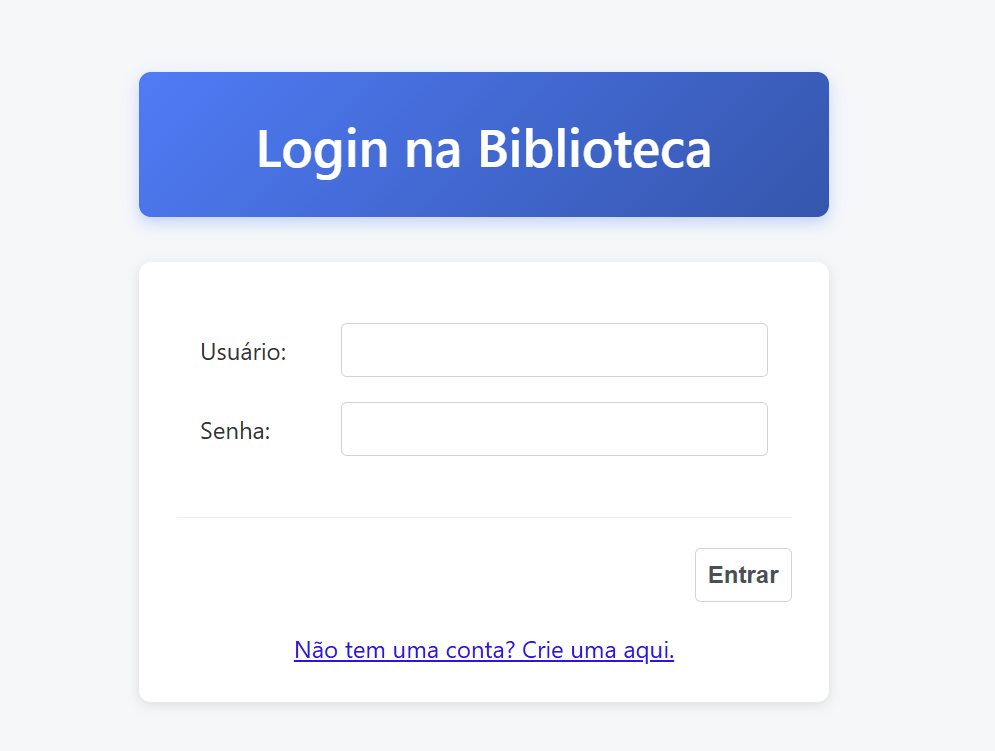
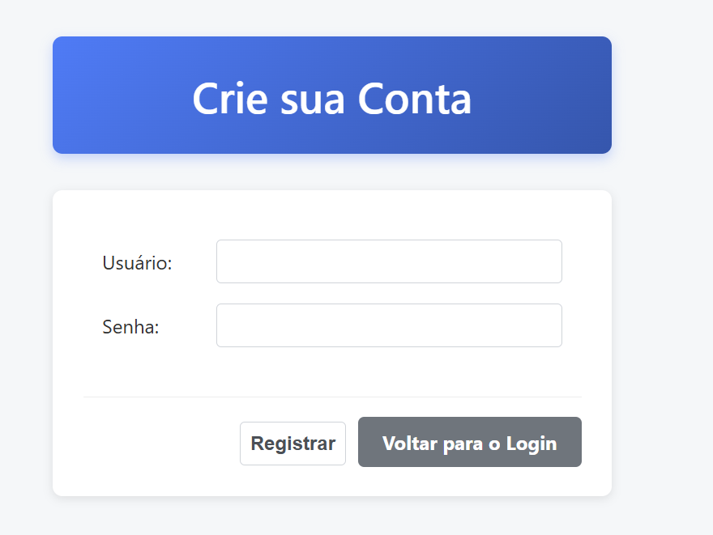
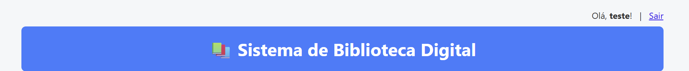

Neste tutorial, vamos refatorar nosso projeto da Biblioteca Digital
para adicionar uma camada de segurança completa.
Implementaremos um fluxo de autenticação com tela de login
e um formulário para registro de novas contas de usuário.

Esta é uma melhoria essencial, pois protege os dados da nossa aplicação,
garantindo que apenas usuários autenticados possam realizar operações de gerenciamento,
como cadastrar livros ou registrar empréstimos. Para isso, utilizaremos a extensão Quarkus Security JPA,
que nos permite usar nossas próprias tabelas do banco de dados como fonte para autenticação,
integrando-se perfeitamente à nossa arquitetura existente.

Pré-requisitos
O projeto "Sistema de Biblioteca Digital" clonado e funcionando.

JDK 17 ou superior.

Apache Maven 3.8.x ou superior.

Um servidor de banco de dados PostgreSQL em execução.

1- Abra seu arquivo pom.xml.

Adicione o seguinte bloco de dependência:

<dependency>
    <groupId>io.quarkus</groupId>
    <artifactId>quarkus-security-jpa</artifactId>
</dependency>

2- Crie o novo arquivo Usuario.java no pacote com.biblioteca.entity:

// src/main/java/com/biblioteca/entity/Usuario.java
package com.biblioteca.entity;

import io.quarkus.security.jpa.Password;
import io.quarkus.security.jpa.Roles;
import io.quarkus.security.jpa.UserDefinition;
import io.quarkus.security.jpa.Username;
import jakarta.persistence.*;

@Entity
@Table(name = "usuarios")
@UserDefinition // Diz ao Quarkus: "Use esta classe para autenticação"
public class Usuario {

    @Id
    @GeneratedValue(strategy = GenerationType.IDENTITY)
    private Long id;

    @Username // Define este campo como o nome de usuário para login
    @Column(unique = true, nullable = false)
    private String username;

    @Password // Define este campo como a senha
    @Column(nullable = false)
    private String password;

    @Roles // Define este campo como a permissão (role) do usuário
    @Column(nullable = false)
    private String role;

    // Getters e Setters
    public Long getId() { return id; }
    public void setId(Long id) { this.id = id; }
    public String getUsername() { return username; }
    public void setUsername(String username) { this.username = username; }
    public String getPassword() { return password; }
    public void setPassword(String password) { this.password = password; }
    public String getRole() { return role; }
    public void setRole(String role) { this.role = role; }
}

3- Crie o UsuarioRepository.java no pacote com.biblioteca.repository:

// src/main/java/com/biblioteca/repository/UsuarioRepository.java
package com.biblioteca.repository;

import com.biblioteca.entity.Usuario;
import jakarta.enterprise.context.ApplicationScoped;
import jakarta.persistence.EntityManager;
import jakarta.persistence.PersistenceContext;

@ApplicationScoped
public class UsuarioRepository {
@PersistenceContext
private EntityManager entityManager;

    public void save(Usuario usuario) {
        entityManager.persist(usuario);
    }
}

4- Crie o UsuarioService.java no pacote com.biblioteca.service:

// src/main/java/com/biblioteca/service/UsuarioService.java
package com.biblioteca.service;

import com.biblioteca.entity.Usuario;
import com.biblioteca.repository.UsuarioRepository;
import io.quarkus.elytron.security.common.BcryptUtil;
import jakarta.enterprise.context.ApplicationScoped;
import jakarta.inject.Inject;
import jakarta.transaction.Transactional;

@ApplicationScoped
public class UsuarioService {
@Inject
UsuarioRepository usuarioRepository;

    @Transactional
    public void registrar(String username, String password) {
        Usuario novoUsuario = new Usuario();
        novoUsuario.setUsername(username);
        novoUsuario.setPassword(BcryptUtil.bcryptHash(password)); // Criptografa a senha
        novoUsuario.setRole("USER"); // Permissão padrão
        usuarioRepository.save(novoUsuario);
    }
}

--Aqui utilizamos BcryptUtil para criptografar a senhar e não salvar em texto puro no banco de dados

5- Modifique o application.properties adiciionando o seguinte trecho:

# application.properties

# --- Configuração de Segurança e Jakarta Faces ---

# Habilita a autenticação baseada em formulário HTML
quarkus.http.auth.form.enabled=true
quarkus.http.auth.form.login-page=/login.xhtml
quarkus.http.auth.form.error-page=/login.xhtml?error=true
quarkus.http.auth.form.landing-page=/index.xhtml

quarkus.http.auth.permission.pages-protegidas.paths=/index.xhtml,/autor.xhtml,/livro.xhtml,/emprestimo.xhtml
quarkus.http.auth.permission.pages-protegidas.policy=authenticated

6- Criar os arquivos xhtml:

Crie o arquivo login.xhtml:

<!DOCTYPE html>
<html xmlns="http://www.w3.org/1999/xhtml"
      xmlns:h="http://xmlns.jcp.org/jsf/html"
      xmlns:f="http://xmlns.jcp.org/jsf/core">
<h:head>
    <title>Login - Biblioteca Digital</title>
    <h:outputStylesheet name="css/style.css" />
</h:head>
<h:body>
    

        <header><h1>Login na Biblioteca</h1></header>
        

            <form action="j_security_check" method="post">
                <h:panelGroup rendered="#{param.error eq 'true'}">
                    

                        Usuário ou senha inválidos.
                    

                </h:panelGroup>

                <h:panelGrid columns="2" styleClass="form-grid">
                    <h:outputLabel value="Usuário:" />
                    <input type="text" name="j_username" class="form-input"/>

                    <h:outputLabel value="Senha:" />
                    <input type="password" name="j_password" class="form-input"/>
                </h:panelGrid>

                

                    <input type="submit" value="Entrar" class="button button-primary"/>
                

            </form>
            

                <h:link outcome="/registro" value="Não tem uma conta? Crie uma aqui."/>
            

        

    

</h:body>
</html>

----------

6.1- registro.xhtml:

<!DOCTYPE html>
<html xmlns="http://www.w3.org/1999/xhtml"
      xmlns:h="http://xmlns.jcp.org/jsf/html">
<h:head>
    <title>Registro - Biblioteca Digital</title>
    <h:outputStylesheet name="css/style.css" />
</h:head>
<h:body>
    

        <header><h1>Crie sua Conta</h1></header>
        

            <h:form>
                <h:messages globalOnly="true" styleClass="faces-message" infoClass="faces-message-info" errorClass="faces-message-error"/>
                <h:panelGrid columns="2" styleClass="form-grid">
                    <h:outputLabel for="username" value="Usuário:" />
                    <h:inputText id="username" value="#{registroBean.username}" required="true" styleClass="form-input"/>

                    <h:outputLabel for="password" value="Senha:" />
                    <h:inputSecret id="password" value="#{registroBean.password}" required="true" styleClass="form-input"/>
                </h:panelGrid>
                

                    <h:commandButton value="Registrar" action="#{registroBean.registrar}" styleClass="button button-primary"/>
                    <h:link outcome="/login" value="Voltar para o Login" styleClass="button button-secondary"/>
                

            </h:form>
        

    

</h:body>
</html>

6.2- Adicione no topo do index.xhtml para receber o usuário logado e exibir um botão de sair:

<h:form rendered="#{userSessionBean.isLoggedIn()}" style="text-align: right; margin-bottom: 10px;">
    Olá, <strong>#{userSessionBean.username}</strong>!
    &#160; | &#160;
    <h:commandLink value="Sair" action="#{userSessionBean.logout}" />
</h:form>

7- Crie o Bean de Controle para registro:

// src/main/java/com/biblioteca/controller/RegistroBean.java
package com.biblioteca.controller;

import com.biblioteca.service.UsuarioService;
import jakarta.faces.application.FacesMessage;
import jakarta.faces.context.FacesContext;
import jakarta.faces.view.ViewScoped;
import jakarta.inject.Inject;
import jakarta.inject.Named;
import java.io.Serializable;

@Named("registroBean")
@ViewScoped
public class RegistroBean implements Serializable {
@Inject
UsuarioService usuarioService;
private String username;
private String password;

    public String registrar() {
        try {
            usuarioService.registrar(username, password);
            FacesContext.getCurrentInstance().getExternalContext().getFlash().setKeepMessages(true);
            FacesContext.getCurrentInstance().addMessage(null,
                new FacesMessage(FacesMessage.SEVERITY_INFO, "Sucesso!", "Conta criada. Faça o login."));
            return "/login.xhtml?faces-redirect=true";
        } catch (Exception e) {
            FacesContext.getCurrentInstance().addMessage(null,
                new FacesMessage(FacesMessage.SEVERITY_ERROR, "Erro!", "Este nome de usuário já existe."));
            return null;
        }
    }

    // Getters e Setters
    public String getUsername() { return username; }
    public void setUsername(String username) { this.username = username; }
    public String getPassword() { return password; }
    public void setPassword(String password) { this.password = password; }
}

8- Crie o UserSessionBean.java no pacote com.biblioteca.controller

// src/main/java/com/biblioteca/controller/UserSessionBean.java
package com.biblioteca.controller;

import jakarta.enterprise.context.SessionScoped;
import jakarta.faces.context.FacesContext;
import jakarta.inject.Named;
import java.io.Serializable;
import java.security.Principal;

@Named("userSessionBean")
@SessionScoped
public class UserSessionBean implements Serializable {

    public String getUsername() {
        Principal principal = FacesContext.getCurrentInstance().getExternalContext().getUserPrincipal();
        return principal != null ? principal.getName() : null;
    }

    public boolean isLoggedIn() {
        return getUsername() != null;
    }

    public String logout() {
        FacesContext.getCurrentInstance().getExternalContext().invalidateSession();
        return "/login.xhtml?faces-redirect=true";
    }
}

9- Agora podemos rodar o projeto da mesma forma através do comando:

mvn quarkus:dev

E acessar no http://localhost:8080

Demonstração da opção de sair e da função de mostrar o usuário logado

